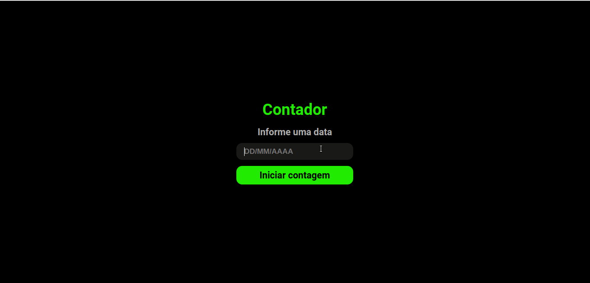

# Contador
Este é um projeto com a finalidade de evoluir minhas skills como programadora. Ele consiste em um desafio 
que tem como finalidade criar um contador (com dias, horas, minutos e segundos), a partir de uma data definida pelo usuário.
O desafio pode ser encontrado no site 
[DevChallange](https://www.devchallenge.com.br/detail/5ed6d70709347b1dbf411b37).

## Demo
     

## Tecnologias
* Moment

## Linguagens
* JavaScript
* HTML
* CSS

## Executar
**Para executar este projeto na sua máquina, siga as instruções:**
* execute o seguinte comando no seu terminal:
`$ git clone https://github.com/dhayananascimento/DevChallenge-contador.git`
* abra a pasta que será  criada
* abra o arquivo "index.html" com o navegador de sua preferência
